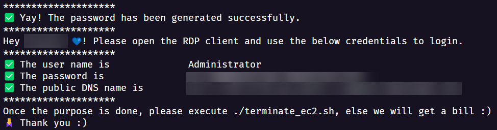

# EC2 Automation

## 🤨 Problem Statement

One of the national bank in India has IP restrictions where their customers will not be able to login to do transactions from foriegn countries. I used to connect via VPN, but for some reasons, we were not able to connect again. I usually spin up an EC2 instance in Asia region to login couple times every month. It is a boring process. Hence this script. I would have implemented this in Terraform or Ansible, but the end user of this script is my wife. I would like to keep this easy with one time setup. Hence the bash.

## ✅ Prerequisites

- AWS Account
- AWS CLI
- IAM Role to create, describe, and terminate EC2
- PEM file to decrypt password

## 🪜 How to?

- Clone this repo `git clone https://github.com/QAInsights/aws-ec2-windows.git`
- `cd aws-ec2-windows`
- Run the below commands

```bash
chmod +x spin-ec2-windows.sh terminate-ec2.sh
```
- To spin up an EC2 instance

```bash
./spin-ec2-windows.sh
```
- After a while, it will display the credentials as shown below



- To terminate this spinned instance

```bash
./terminate-ec2.sh
```


## 📖 References

- https://aws.amazon.com/cli/
- https://docs.aws.amazon.com/AWSEC2/latest/UserGuide/iam-roles-for-amazon-ec2.html
- https://docs.aws.amazon.com/AWSEC2/latest/UserGuide/create-key-pairs.html